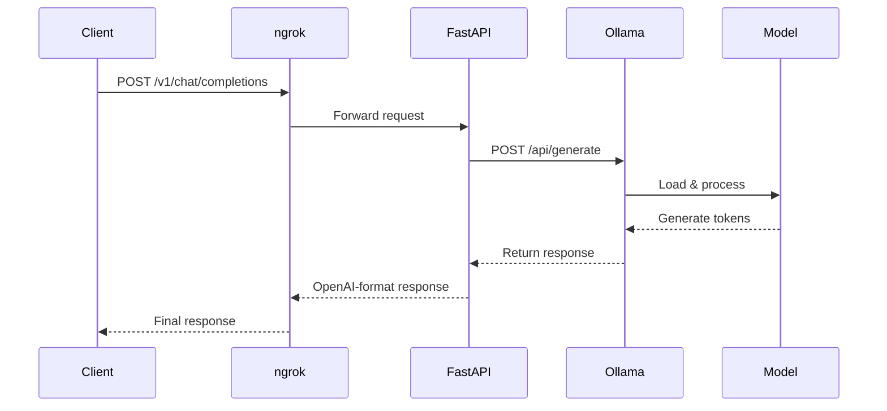

# 🚀 Self-Hosted AI API

> Run your own AI model and expose it as an OpenAI-compatible API endpoint. No OpenAI API key required.

[](https://opensource.org/licenses/MIT)
[](https://www.python.org/downloads/)
[](https://fastapi.tiangolo.com/)

---

## 💡 What Is This? (In Simple Terms)

**This is your own private AI API** that works exactly like OpenAI's API, but runs on your own infrastructure instead of sending requests to OpenAI.

### The Problem It Solves

| With OpenAI API | With This Project |
|-----------------|-------------------|
| Pay per request 💰 | Free (your own hardware) 🆓 |
| Send data to OpenAI | Data stays on your servers 🔒 |
| Depend on their uptime | You control availability 🎛️ |
| Fixed models | Choose any open-source model 🔄 |

### How It Works (Simple Flow)

```
Your App → This API → Ollama (runs the model) → Response back
```

It's a wrapper that makes any open-source AI model look like OpenAI's API. **Same code, different backend.**

### Is This Useful For You?

**✅ Yes, if you:**
- Build apps that use AI and want to reduce API costs
- Need to keep data private (can't send to OpenAI)
- Want to experiment with different open-source models
- Are learning about self-hosting AI infrastructure

**❌ No, if you:**
- Are happy with OpenAI and others don't mind the costs
- Need the absolute best models (GPT-4 still beats open-source)
- Don't want to manage any infrastructure

### Bottom Line

This is a **learning project + cost-saving tool**. It lets you:
1. Understand how AI APIs work under the hood
2. Deploy AI without depending on OpenAI
3. Save money on high-volume usage

---

## 📖 Overview

This project allows you to host your own AI model and expose it as a public API endpoint that's **compatible with OpenAI's API format**. 

Instead of relying on OpenAI or other paid AI services, you can:
- ✅ Run open-source models (Llama, Qwen, Mistral, etc.)
- ✅ Use free GPU resources (Google Colab) or your own hardware
- ✅ Expose your API publicly via ngrok
- ✅ Maintain full control over your AI infrastructure

## 🏗️ Architecture

```
┌─────────────┐      ┌─────────────┐      ┌─────────────┐      ┌─────────────┐
│   Your      │      │   ngrok     │      │   Colab     │      │   Ollama    │
│   App       │ ───► │   Tunnel    │ ───► │   GPU       │ ───► │   + Model   │
│             │      │             │      │   Server    │      │             │
└─────────────┘      └─────────────┘      └─────────────┘      └─────────────┘
     │                      │                      │                      │
     │  1. POST request     │  2. Forward via      │  3. Route to         │  4. Generate
     │  /v1/chat/           │     public URL       │     FastAPI          │     response
     │  completions         │                      │                      │
```

### System Flow Diagram



## 🛠️ Tech Stack

| Component | Purpose |
|-----------|---------|
| **Ollama** | Model runtime and inference |
| **Qwen / Llama / Mistral** | Open-source LLM models |
| **FastAPI** | REST API framework |
| **ngrok** | Public URL tunneling |
| **Google Colab** | Free GPU hosting (optional) |
| **uvicorn** | ASGI server |

## 📁 Project Structure

```
ai-endpoint/
├── src/
│   └── app.py              # Main FastAPI application
├── config/
│   └── settings.py         # Configuration management
├── docs/
│   └── architecture.md     # Detailed architecture docs
├── assets/
│   └── diagrams/           # Architecture diagrams
├── notebooks/
│   └── run_colab.ipynb     # Google Colab notebook
├── scripts/
│   ├── setup.sh            # Linux/Mac setup script
│   └── setup.bat           # Windows setup script
├── docker/
│   └── Dockerfile          # Docker deployment config
├── requirements.txt        # Python dependencies
├── .env.example            # Environment variables template
├── .gitignore
└── README.md
```

## ⚡ Quick Start

### Option 1: Google Colab (Free GPU)

1. **Open the Colab Notebook**
   ```
   Navigate to notebooks/run_colab.ipynb
   ```

2. **Run all cells** - This will:
   - Install Ollama
   - Pull the model
   - Start FastAPI
   - Expose via ngrok

3. **Get your public URL**
   ```
   The notebook will output: https://xxxx-xxxx.ngrok.io
   ```

### Option 2: Local Development

```bash
# Clone the repository
git clone https://github.com/yourusername/ai-endpoint.git
cd ai-endpoint

# Install dependencies
pip install -r requirements.txt

# Start Ollama (ensure Ollama is installed)
ollama serve

# Pull a model
ollama pull qwen:1.8b

# Run the API
python src/app.py

# Test the endpoint
curl http://localhost:8000/health
```

## 🔌 API Usage

### Chat Completions (OpenAI-Compatible)

```bash
curl https://YOUR_NGROK_URL/v1/chat/completions \
  -H "Content-Type: application/json" \
  -d '{
    "model": "qwen:1.8b",
    "messages": [
      {"role": "user", "content": "Hello, how are you?"}
    ]
  }'
```

### Response Format

```json
{
  "id": "chatcmpl-1",
  "object": "chat.completion",
  "created": 1234567890,
  "model": "qwen:1.8b",
  "choices": [
    {
      "index": 0,
      "message": {
        "role": "assistant",
        "content": "Hello! I'm doing well, thank you for asking."
      },
      "finish_reason": "stop"
    }
  ],
  "usage": {
    "prompt_tokens": 10,
    "completion_tokens": 12,
    "total_tokens": 22
  }
}
```

### Python Client Example

```python
import requests

NGROK_URL = "https://your-url.ngrok.io"

response = requests.post(
    f"{NGROK_URL}/v1/chat/completions",
    json={
        "messages": [
            {"role": "user", "content": "Explain quantum computing"}
        ]
    }
)

print(response.json()["choices"][0]["message"]["content"])
```

### OpenAI SDK Compatible

```python
from openai import OpenAI

# Point to your self-hosted endpoint
client = OpenAI(
    base_url="https://your-url.ngrok.io/v1",
    api_key="not-needed"  # Not required for self-hosted
)

response = client.chat.completions.create(
    model="qwen:1.8b",
    messages=[
        {"role": "user", "content": "Hello!"}
    ]
)

print(response.choices[0].message.content)
```

## 📋 Available Endpoints

| Endpoint | Method | Description |
|----------|--------|-------------|
| `/health` | GET | Health check |
| `/v1/models` | GET | List available models |
| `/v1/chat/completions` | POST | Chat completions (OpenAI-compatible) |
| `/api/generate` | POST | Direct Ollama generate endpoint |

## 🔧 Configuration

### Environment Variables

Create a `.env` file based on `.env.example`:

```bash
# Ollama Configuration
OLLAMA_HOST=127.0.0.1
OLLAMA_PORT=11434

# Model Configuration
DEFAULT_MODEL=qwen:1.8b

# ngrok Configuration (optional)
NGROK_AUTH_TOKEN=your_token_here
```

### Supported Models

Any model available through Ollama can be used:

```bash
ollama pull llama2          # Meta Llama 2
ollama pull mistral         # Mistral 7B
ollama pull qwen:1.8b       # Qwen 1.8B (default)
ollama pull qwen:7b         # Qwen 7B
ollama pull phi             # Microsoft Phi
ollama pull gemma           # Google Gemma
```

## 🐳 Docker Deployment

```bash
# Build the image
docker build -t ai-endpoint .

# Run the container
docker run -d \
  -p 8000:8000 \
  -e OLLAMA_HOST=host.docker.internal \
  --name ai-endpoint \
  ai-endpoint
```

## 🚨 Important Notes

### Google Colab Limitations

- ⚠️ **Sessions are temporary** - Colab runtime disconnects after ~12 hours
- ⚠️ **GPU availability** - Free tier GPU access varies
- ⚠️ **ngrok URLs change** - Each session gets a new public URL

### Production Recommendations

For production use, consider:

1. **Persistent Infrastructure**
   - Deploy on a cloud VM (AWS, GCP, Azure)
   - Use a dedicated GPU instance

2. **Domain & SSL**
   - Use a custom domain instead of ngrok
   - Set up proper SSL certificates

3. **Authentication**
   - Add API key authentication
   - Implement rate limiting

4. **Monitoring**
   - Add logging and metrics
   - Set up health checks and alerts

## 📊 Performance Benchmarks

| Model | VRAM Required | Tokens/sec (T4 GPU) | Context Length |
|-------|---------------|---------------------|----------------|
| Qwen 1.8B | ~2 GB | ~40 tok/s | 4K |
| Llama 2 7B | ~6 GB | ~20 tok/s | 4K |
| Mistral 7B | ~6 GB | ~18 tok/s | 8K |
| Qwen 7B | ~6 GB | ~18 tok/s | 4K |

## 🤝 Contributing

Contributions are welcome! Please feel free to submit a Pull Request.

1. Fork the repository
2. Create your feature branch (`git checkout -b feature/AmazingFeature`)
3. Commit your changes (`git commit -m 'Add some AmazingFeature'`)
4. Push to the branch (`git push origin feature/AmazingFeature`)
5. Open a Pull Request

## 📄 License

This project is licensed under the MIT License - see the LICENSE file for details.

## 🙏 Acknowledgments

- [Ollama](https://ollama.ai/) - Local LLM runtime
- [FastAPI](https://fastapi.tiangolo.com/) - Modern Python web framework
- [ngrok](https://ngrok.com/) - Secure tunnel to localhost
- [Google Colab](https://colab.research.google.com/) - Free GPU access

## 📞 Support

- Documentation: [docs/architecture.md](docs/architecture.md)
- Issues: [GitHub Issues](https://github.com/yourusername/ai-endpoint/issues)

---

<p align="center">Made with ❤️ by the open-source community</p>
