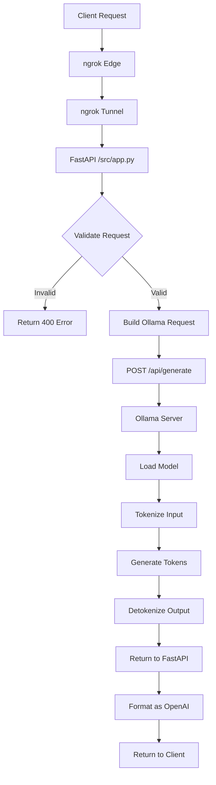

# Architecture Documentation

## System Overview

This document provides a detailed explanation of the Self-Hosted AI API architecture, including component interactions, data flow, and deployment options.

## High-Level Architecture

```
┌─────────────────────────────────────────────────────────────────────────┐
│                         EXTERNAL CLIENTS                                │
│                    (Web Apps, Mobile, APIs)                             │
└─────────────────────────────────────────────────────────────────────────┘
                                      │
                                      ▼
┌─────────────────────────────────────────────────────────────────────────┐
│                           NGROK TUNNEL                                  │
│                    (Public URL → Private Service)                       │
│                  URL: https://xxxx.ngrok.io                             │
└─────────────────────────────────────────────────────────────────────────┘
                                      │
                                      ▼
┌─────────────────────────────────────────────────────────────────────────┐
│                         FASTAPI SERVER                                  │
│                      (src/app.py)                                       │
│  ┌──────────────────────────────────────────────────────────────────┐  │
│  │  Endpoints:                                                      │  │
│  │  • GET  /health          - Health check                          │  │
│  │  • GET  /v1/models       - List models                           │  │
│  │  • POST /v1/chat/completions - Chat API (OpenAI-compatible)      │  │
│  │  • POST /api/generate    - Direct Ollama access                  │  │
│  └──────────────────────────────────────────────────────────────────┘  │
└─────────────────────────────────────────────────────────────────────────┘
                                      │
                                      ▼
┌─────────────────────────────────────────────────────────────────────────┐
│                           OLLAMA SERVER                                 │
│                      (LLM Runtime Engine)                               │
│  ┌──────────────────────────────────────────────────────────────────┐  │
│  │  Endpoints:                                                      │  │
│  │  • POST /api/generate    - Text generation                       │  │
│  │  • POST /api/chat        - Chat completions                      │  │
│  │  • GET  /api/tags        - List loaded models                    │  │
│  └──────────────────────────────────────────────────────────────────┘  │
└─────────────────────────────────────────────────────────────────────────┘
                                      │
                                      ▼
┌─────────────────────────────────────────────────────────────────────────┐
│                           AI MODEL                                      │
│              (Qwen, Llama, Mistral, etc.)                               │
│  ┌──────────────────────────────────────────────────────────────────┐  │
│  │  Model Files:                                                    │  │
│  │  • Quantized weights (GGUF format)                               │  │
│  │  • Tokenizer configuration                                       │  │
│  │  • Model architecture definition                                 │  │
│  └──────────────────────────────────────────────────────────────────┘  │
└─────────────────────────────────────────────────────────────────────────┘
```

## Component Details

### 1. ngrok Tunnel

**Purpose:** Exposes the local FastAPI server to the internet via a secure tunnel.

**Configuration:**
```python
from pyngrok import ngrok

ngrok.set_auth_token("YOUR_TOKEN")
public_url = ngrok.connect(8000)
print(f"Public URL: {public_url}")
```

**Key Features:**
- HTTPS termination at ngrok edge
- Automatic SSL certificate management
- Request forwarding to localhost:8000
- Optional request inspection and logging

### 2. FastAPI Server

**Purpose:** Provides OpenAI-compatible REST API endpoints.

**Request Flow:**
1. Receive HTTP POST at `/v1/chat/completions`
2. Parse JSON body with Pydantic models
3. Extract conversation messages
4. Forward to Ollama's `/api/generate`
5. Transform response to OpenAI format
6. Return JSON response

**Key Code:**
```python
@app.post("/v1/chat/completions")
async def chat_completions(request: ChatCompletionRequest):
    # Extract latest message
    prompt = request.messages[-1].content
    
    # Call Ollama
    response = requests.post(
        OLLAMA_URL,
        json={"model": request.model, "prompt": prompt}
    )
    
    # Return OpenAI-compatible response
    return {"choices": [{"message": {"content": response.json()["response"]}}]}
```

### 3. Ollama Server

**Purpose:** Runs the actual LLM inference on GPU hardware.

**Architecture:**
- Built on llama.cpp for efficient GPU inference
- Supports GGUF quantized model format
- Manages model loading and memory
- Handles tokenization and generation

**API Endpoints:**
```
POST /api/generate
{
    "model": "qwen:1.8b",
    "prompt": "Hello",
    "stream": false
}

Response:
{
    "model": "qwen:1.8b",
    "response": "Hello! How can I help you?",
    "done": true
}
```

### 4. AI Models

**Supported Models:**
| Model | Parameters | VRAM | License |
|-------|------------|------|---------|
| Qwen 1.8B | 1.8B | 2GB | Apache 2.0 |
| Llama 2 7B | 7B | 6GB | Custom |
| Mistral 7B | 7B | 6GB | Apache 2.0 |
| Phi 2 | 2.7B | 3GB | MIT |

## Data Flow

### Request Lifecycle



### Message Format Transformation

**Incoming (OpenAI Format):**
```json
{
    "model": "qwen:1.8b",
    "messages": [
        {"role": "user", "content": "Hello"}
    ]
}
```

**Internal (Ollama Format):**
```json
{
    "model": "qwen:1.8b",
    "prompt": "user: Hello",
    "stream": false
}
```

**Outgoing (OpenAI Format):**
```json
{
    "id": "chatcmpl-1",
    "object": "chat.completion",
    "model": "qwen:1.8b",
    "choices": [{
        "index": 0,
        "message": {
            "role": "assistant",
            "content": "Hello! How can I help?"
        },
        "finish_reason": "stop"
    }]
}
```

## Deployment Options

### Option 1: Google Colab (Development)

```
┌─────────────────────────────────────┐
│         Google Colab VM             │
│  ┌───────────────────────────────┐  │
│  │  T4 GPU (16GB VRAM)           │  │
│  │                               │  │
│  │  ┌─────────┐  ┌────────────┐  │  │
│  │  │ Ollama  │  │  FastAPI   │  │  │
│  │  │ Server  │─▶│  Server    │  │  │
│  │  └─────────┘  └────────────┘  │  │
│  │                     │         │  │
│  │               ┌─────▼─────┐   │  │
│  │               │  ngrok    │   │  │
│  │               │  Agent    │   │  │
│  │               └─────┬─────┘   │  │
│  └─────────────────────┼─────────┘  │
└────────────────────────┼────────────┘
                         │
                         ▼
              ┌─────────────────────┐
              │   Public Internet   │
              │   (via ngrok.io)    │
              └─────────────────────┘
```

**Pros:**
- Free GPU access
- No infrastructure setup
- Quick prototyping

**Cons:**
- Temporary sessions (~12 hours)
- Unreliable for production
- ngrok URL changes each session

### Option 2: Cloud VM (Production)

```
┌─────────────────────────────────────────────────────────┐
│              Cloud Provider (AWS/GCP/Azure)             │
│                                                         │
│  ┌───────────────────────────────────────────────────┐  │
│  │              GPU Instance (g4dn.xlarge)           │  │
│  │                                                   │  │
│  │  ┌─────────────────────────────────────────────┐  │  │
│  │  │              Docker Container               │  │  │
│  │  │  ┌─────────┐  ┌─────────┐  ┌────────────┐  │  │  │
│  │  │  │ Ollama  │  │ FastAPI │  │   nginx    │  │  │  │
│  │  │  │         │─▶│         │─▶│  (SSL)     │  │  │  │
│  │  │  └─────────┘  └─────────┘  └────────────┘  │  │  │
│  │  └─────────────────────────────────────────────┘  │  │
│  │                                                   │  │
│  └───────────────────────────────────────────────────┘  │
│                                                         │
│  ┌───────────────────────────────────────────────────┐  │
│  │              Load Balancer + Domain               │  │
│  │              ai.yourdomain.com                    │  │
│  └───────────────────────────────────────────────────┘  │
└─────────────────────────────────────────────────────────┘
```

**Pros:**
- Persistent infrastructure
- Custom domain support
- Production reliability
- Full control

**Cons:**
- Monthly cost (~$100-300/mo)
- Requires DevOps knowledge

## Security Considerations

### Current State
- ⚠️ No authentication required
- ⚠️ Open API endpoint (when exposed)
- ⚠️ No rate limiting

### Recommended Additions

```python
# Add API key authentication
@app.middleware("http")
async def auth_middleware(request: Request, call_next):
    api_key = request.headers.get("X-API-Key")
    if api_key != os.getenv("API_KEY"):
        return JSONResponse(status_code=401, content={"error": "Unauthorized"})
    return await call_next(request)

# Add rate limiting
from slowapi import Limiter
limiter = Limiter(key_func=get_remote_address)

@app.post("/v1/chat/completions")
@limiter.limit("10/minute")
async def chat_completions(request: Request):
    ...
```

## Monitoring & Observability

### Health Checks

```bash
# Check API health
curl https://your-url.ngrok.io/health

# Expected response:
{"status": "healthy", "ollama_url": "http://127.0.0.1:11434"}
```

### Logging

Add structured logging:

```python
import logging
logging.basicConfig(level=logging.INFO)
logger = logging.getLogger(__name__)

@app.post("/v1/chat/completions")
async def chat_completions(request: ChatCompletionRequest):
    logger.info(f"Received request with {len(request.messages)} messages")
    ...
```

### Metrics to Track

- Request latency (p50, p95, p99)
- Token generation rate
- Error rates by endpoint
- GPU utilization
- Memory usage

## Troubleshooting

### Common Issues

| Issue | Cause | Solution |
|-------|-------|----------|
| Connection refused | Ollama not running | `ollama serve` |
| Model not found | Model not pulled | `ollama pull qwen:1.8b` |
| ngrok timeout | Free tier limit | Upgrade or rotate URLs |
| OOM error | Model too large | Use smaller model or more VRAM |

### Debug Commands

```bash
# Check Ollama status
curl http://localhost:11434/api/tags

# Test FastAPI directly
curl http://localhost:8000/health

# Check ngrok tunnel
curl http://localhost:4040/api/tunnels
```
